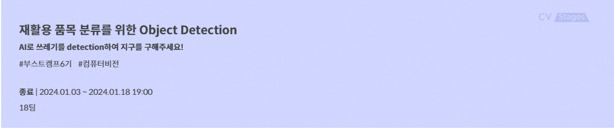
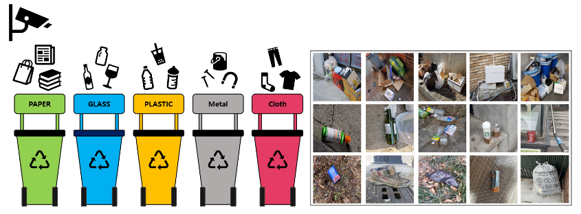
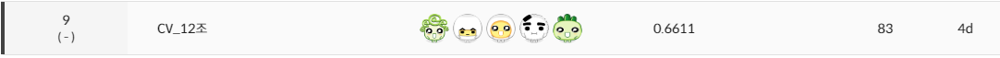
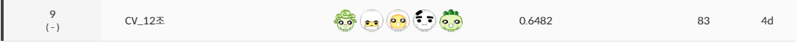
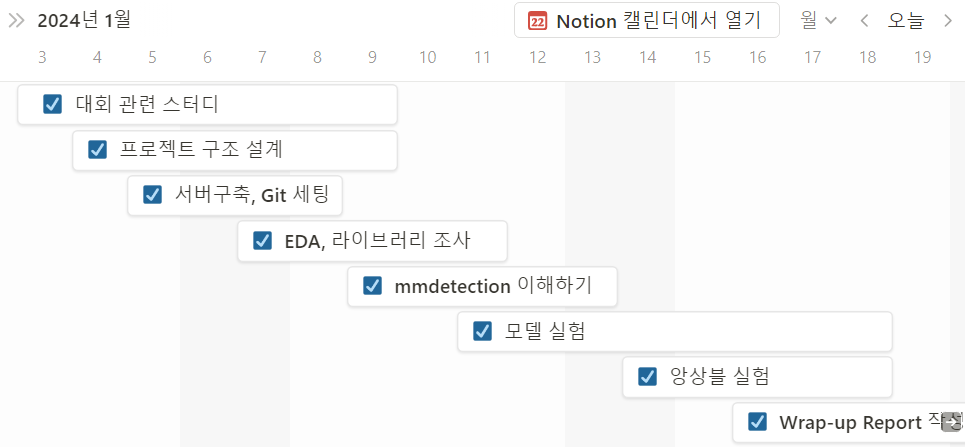
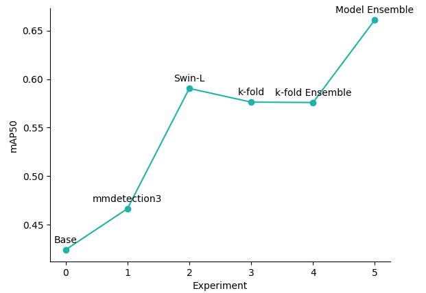

# 재활용 품목 분류를 위한 Object Detection

- 2024.01.03 ~ 2024.01.18
- 네이버 커넥트 재단 및 Upstage에서 주관하는 비공개 대회
- Team Report : [Object Det_CV_팀 리포트(12조).pdf](https://github.com/boostcampaitech6/level2-objectdetection-cv-12/files/14072573/Object.Det_CV_.12.pdf)

## MEMBERS

> 공통으로 EDA, 모델 실험
>
>[김세진](https://github.com/Revabo): Ensemble, Augmentation 실험, Github 초기 세팅, YOLO 실험
>
>[박혜나](https://github.com/heynapark): wandb 팀 연동, cascade R-CNN & DDQ & DINO 모델 실험, 추론 결과 시각화
>
>[이동우](https://github.com/Dong-Uri): valid set을 위한 split, EfficientDet 실험 및 관련 tool 생성 (aug 등)
>
>[진민주](https://github.com/freenozero): bbox 시각화(train, inference), retinanet & cascade_swinL 모델 실험, pseudo-labeling
>
>[허재영](https://github.com/jae-heo): mmdetection3/rtmdet&detectors
 

## 문제 정의(대회소개) & Project Overview

바야흐로 대량 생산, 대량 소비의 시대. 우리는 많은 물건이 대량으로 생산되고, 소비되는 시대를 살고 있습니다. 하지만 이러한 문화는 '쓰레기 대란', '매립지 부족'과 같은 여러 사회 문제를 낳고 있습니다.

분리수거는 이러한 환경 부담을 줄일 수 있는 방법 중 하나입니다. 잘 분리배출 된 쓰레기는 자원으로서 가치를 인정받아 재활용되지만, 잘못 분리배출 되면 그대로 폐기물로 분류되어 매립 또는 소각되기 때문입니다.

따라서 우리는 사진에서 쓰레기를 Detection 하는 모델을 만들어 이러한 문제점을 해결해보고자 합니다. 문제 해결을 위한 데이터셋으로는 일반 쓰레기, 플라스틱, 종이, 유리 등 10 종류의 쓰레기가 찍힌 사진 데이터셋이 제공됩니다.

여러분에 의해 만들어진 우수한 성능의 모델은 쓰레기장에 설치되어 정확한 분리수거를 돕거나, 어린아이들의 분리수거 교육 등에 사용될 수 있을 것입니다. 부디 지구를 위기로부터 구해주세요! 🌎

## Dataset

- 전체 이미지 개수 : 9754장
- 10 class : General trash, Paper, Paper pack, Metal, Glass, Plastic, Styrofoam, Plastic bag, Battery, Clothing
- 이미지 크기 : (1024, 1024)

## METRICS

- mAP50
$$\text { Precision }=\frac{T P}{T P+F P}=\frac{T P}{\text { AllDetections }}$$
$$\text { Recall }=\frac{\mathrm{TP}}{\mathrm{TP}+\mathrm{FN}}=\frac{\mathrm{TP}}{\text { all ground truths }}$$
$$\mathrm{mAP}=\frac{1}{n} \sum_{k=1}^n A P_k $$

### LB Score

Public, Private 9등!

### TOOLS

- Github
- Notion
- Slack
- Wandb

## Project Outline

### Models

- Faster RCNN
- Cascade RCNN
- Retinanet
- Yolov5
- Yolov8
- EfficientDet
- rtmdet
- DDQ
- Dino

### Backbones

- Swin Transformer
- Resnet
- ResNest
- ResNEXT
- EfficientNet

### Augmentations

- Mosaic
- Albumentation

## Results

---
### mmdetection 버전 3 설치 가이드

#### 1. 가상환경 세팅
    conda create --name openmmlab python=3.8 -y
    conda activate openmmlab

#### 2. torch 설치
    pip install torch==1.12.1+cu113 torchvision==0.13.1+cu113 torchaudio==0.12.1 --extra-index-url https://download.pytorch.org/whl/cu113
#### 3. 공식 사이트 참고해서 데모 돌아가는지 확인
    https://mmdetection.readthedocs.io/en/latest/get_started.html
#### 4. Common_config.py 생성(mmdetection하위에 바로)
##### __base__ 부분만 경로 수정해주시면됩니다.
#### 5. submission_hook.py 훅 생성(mmdetection/mmdet/engine/hooks에)
##### 이 부분 수정해주시면 됩니다.
    self.file_names.append(output.img_path[-13:])
#### 6. __init__.py 훅 등록 (mmdetection/mmdet/engine/hooks에)
    from .submission_hook import SubmissionHook
    
    __all__ = [
    'YOLOXModeSwitchHook', 'SyncNormHook', 'CheckInvalidLossHook',
    'SetEpochInfoHook', 'MemoryProfilerHook', 'DetVisualizationHook',
    'NumClassCheckHook', 'MeanTeacherHook', 'trigger_visualization_hook',
    'PipelineSwitchHook', 'TrackVisualizationHook',
    'GroundingVisualizationHook', 'SubmissionHook']
#### 7. train.py생성 및 실행
    from mmengine.config import Config
    from mmengine.runner import Runner
    config = Config.fromfile('Common_Config.py')
    config.work_dir = './work_dirs/faster_rcnn_r50_fpn_1x_trash'
    runner = Runner.from_cfg(config)
    runner.train()
    runner.test()

---
### effdet 가이드

#### train
train.py를 실행하여 학습합니다.
config.yaml을 사용하면 편하게 parser들을 설정할 수 있습니다.
wandb 이름은 train.py 파일 내에서 지정해 줍니다.

#### inference
validate.py를 실행하여 추론합니다.
학습시 .pth.tar 확장자로 저장된 파일에서 .tar를 지워주어야 합니다.
따로 config 파일이 없기에 parser에 적잘한 값들을 넣어주셔야 합니다.
결과값은 coco형식의 annotation 값들이 나오게 됩니다.
이 파일을 coco_to_voc.py를 통해 변경하면 제출형식에 맞는 csv 파일을 저장하게됩니다.
